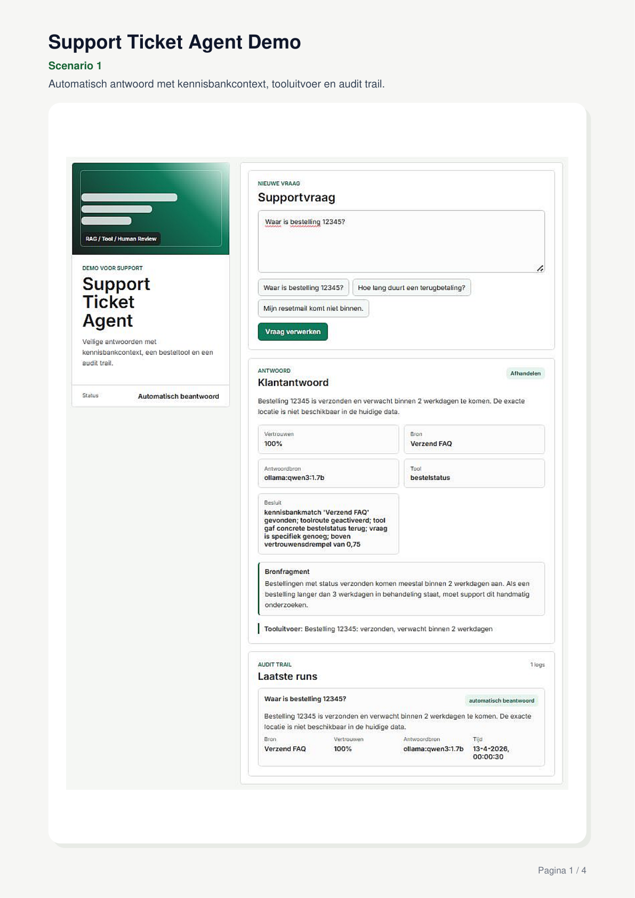
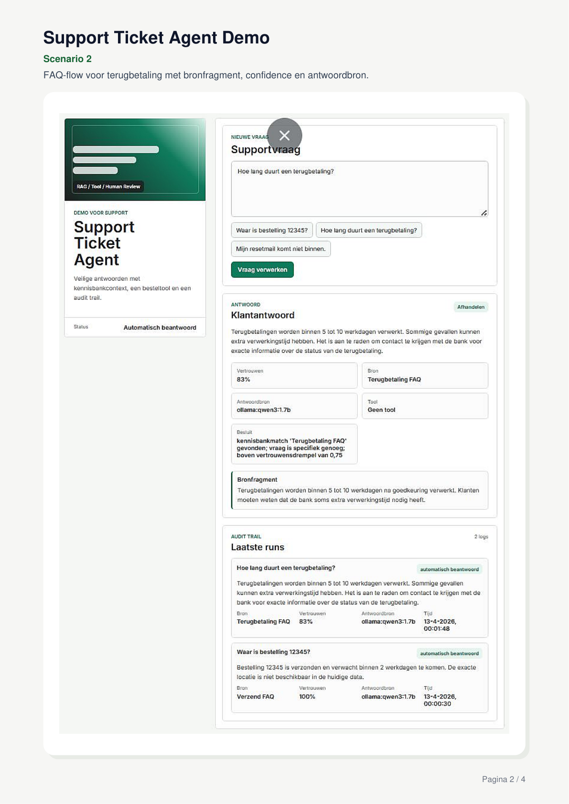
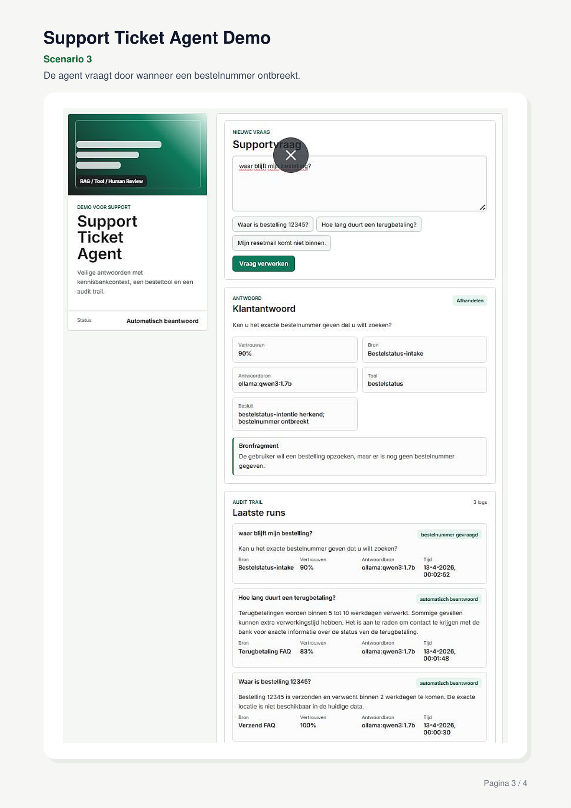
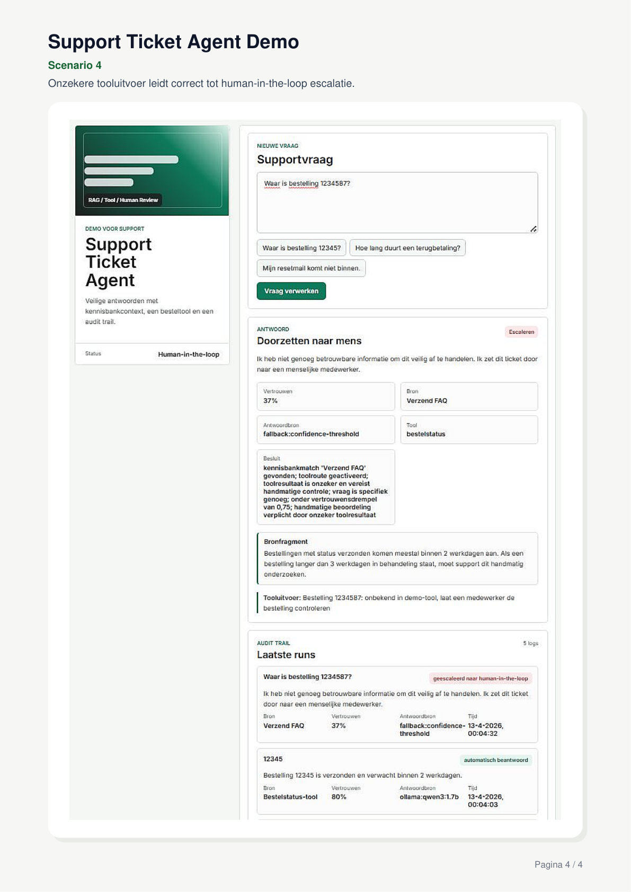

# Support Ticket Agent Demo

Markdown-versie van de PDF met screenshots. De afbeeldingen staan los in de map `images/`, zodat GitHub ze direct kan weergeven.

## Scenario's

| Scenario | Beschrijving |
|---|---|
| Scenario 1 | Automatisch antwoord met kennisbankcontext, tooluitvoer en audit trail. |
| Scenario 2 | FAQ-flow voor terugbetaling met bronfragment, confidence en antwoordbron. |
| Scenario 3 | De agent vraagt door wanneer een bestelnummer ontbreekt. |
| Scenario 4 | Onzekere tooluitvoer leidt correct tot human-in-the-loop escalatie. |

---

## Scenario 1

Automatisch antwoord met kennisbankcontext, tooluitvoer en audit trail.



---

## Scenario 2

FAQ-flow voor terugbetaling met bronfragment, confidence en antwoordbron.



---

## Scenario 3

De agent vraagt door wanneer een bestelnummer ontbreekt.



---

## Scenario 4

Onzekere tooluitvoer leidt correct tot human-in-the-loop escalatie.



---

## GitHub-structuur

Gebruik deze structuur in je repository:

```text
repo/
├─ README.md
└─ images/
   ├─ scenario-1.png
   ├─ scenario-2.png
   ├─ scenario-3.png
   └─ scenario-4.png
```

Upload `README.md` samen met de map `images/`, anders worden de afbeeldingen niet geladen.
